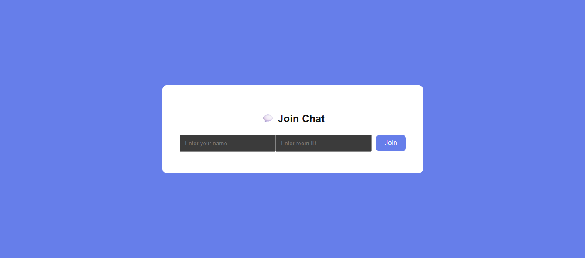
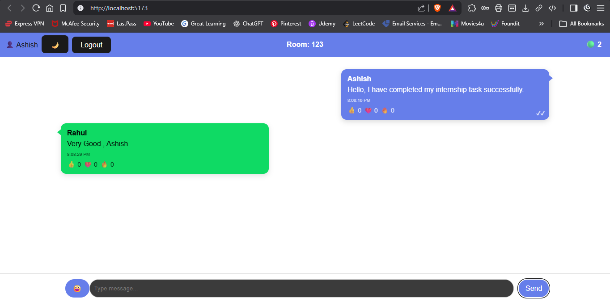
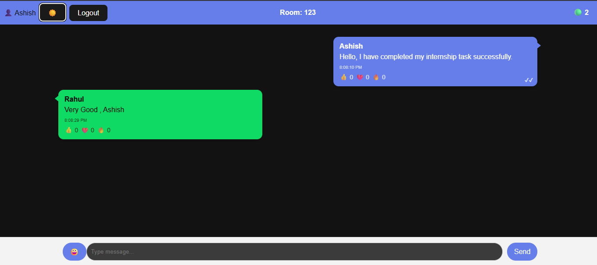

# 💬 Real-Time Chat Application

A modern real-time chat application built using **React.js, Node.js, Express, and Socket.IO** with private rooms, typing indicator, reactions, and dark mode.

---

## 🚀 Features

✅ Real-time messaging  
✅ Private chat rooms  
✅ Typing indicator (who is typing)  
✅ Emoji picker 😀  
✅ Message reactions 👍 ❤️ 🔥  
✅ Dark mode 🌙  
✅ Online users counter  
✅ Message status (sent)  
✅ Mobile responsive UI  

---

## 🛠️ Tech Stack

### Frontend
- React.js
- Socket.IO Client
- CSS

### Backend
- Node.js
- Express.js
- Socket.IO
- CORS

---

## 📸 Screenshots

### Join Screen

### Chat UI

### Dark Mode

---

## ⚙️ Installation & Setup

### 1️⃣ Clone Repository

git clone https://github.com/ashishsalunke24/real-time-chat-app.git
cd real-time-chat-app

### 2️⃣ Install Backend Dependencies

cd server
npm install
Run backend:
node index.js

### 3️⃣ Install Frontend Dependencies

Open new terminal:
cd client
npm install
npm run dev

### 4️⃣ Open in Browser

http://localhost:5173

📂 Project Structure

real-time-chat-app
│
├── Backend        # Node backend
├── Frontend        # React frontend
├── screenshots   # Project images
└── README.md
👨‍💻 Author

Ashish Salunke
GitHub: https://github.com/ashishsalunke24

📜 License

This project is licensed under the MIT License.
